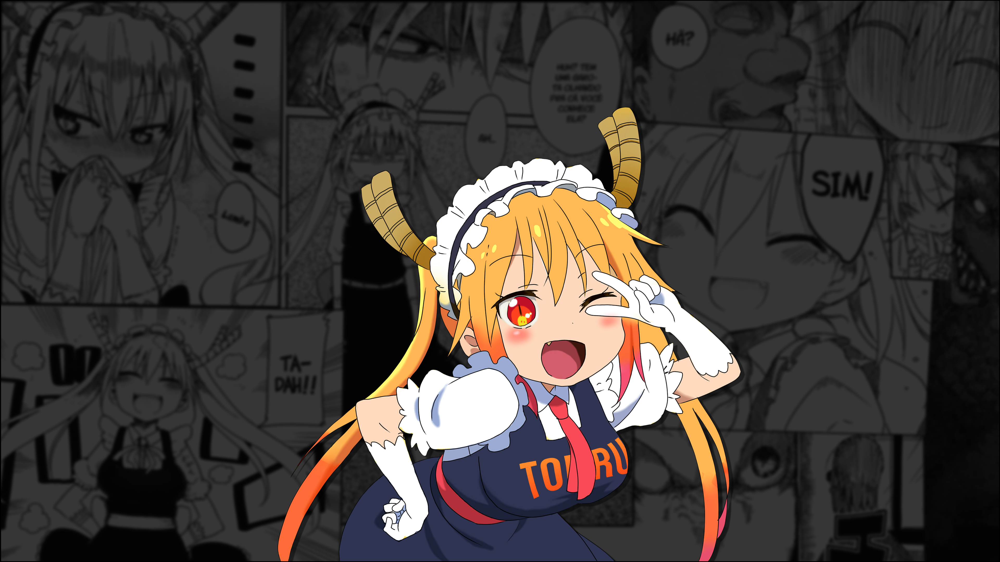
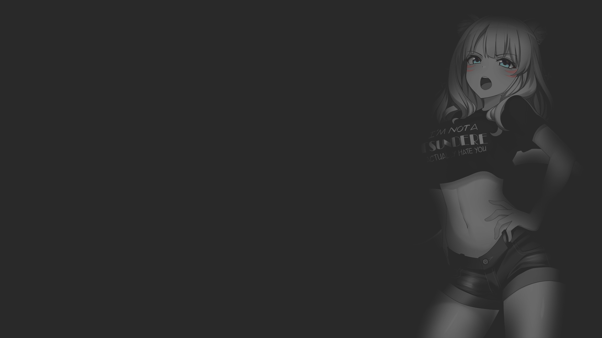

    <h1>Dotfiles</h1>
    

        These are my personal dotfiles for my GNU/Linux
        development environments.
    

    

> Much of my setup uses the doom emacs' doom-one colorscheme.

**My setup has some extra dependencies, see the notes below.**

#### NOTES
 
1. I'm using pipewire instead of pulseaudio but the pavolume script of my polybar
   _should_ work as expected with pulseaudio too.

---

## Content

- Environment setup
  - Wallpapers
  - Configurations
    - awesome
    - polybar
    - rofi
    - picom (A jonaburg's fork up-to-date, you can find the binaries [here](./bin))
    - flameshot
- Other configurations
  - Shells
    - ZSH (zinit)
  -  Editors
    - Neovim (Doom Nvim, requires Neovim >= 0.5)
  - Terminal tools
    - bat
    - lsd
    - xplr
    - htop
    - bpytop (with custom doom-one theme)
    - neofetch

### Installing

Clone the repository and copy the directories to their proper location,
nothing more.

### Neovim

I use [Doom Nvim](https://github.com/NTBBloodbath/doom-nvim) as my daily use
setup for Neovim (Neovim nightly required).

---

### Wallpapers

|                    Tohru (manga)                    |                Cat girl                |                Okita Souji              |
| :----------------------------------------------------: |:--------------------------------------:| :------------------------------------: |
|  |  |  |

> All the credits of the images go to their authors (I don't know what they are).
>
> You can find more wallpapers at [wallpapers directory](./wallpapers)
