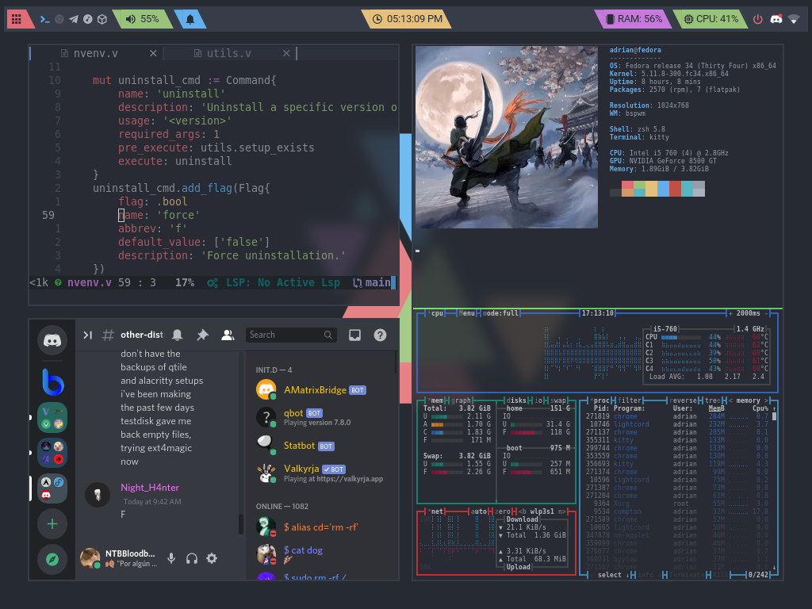
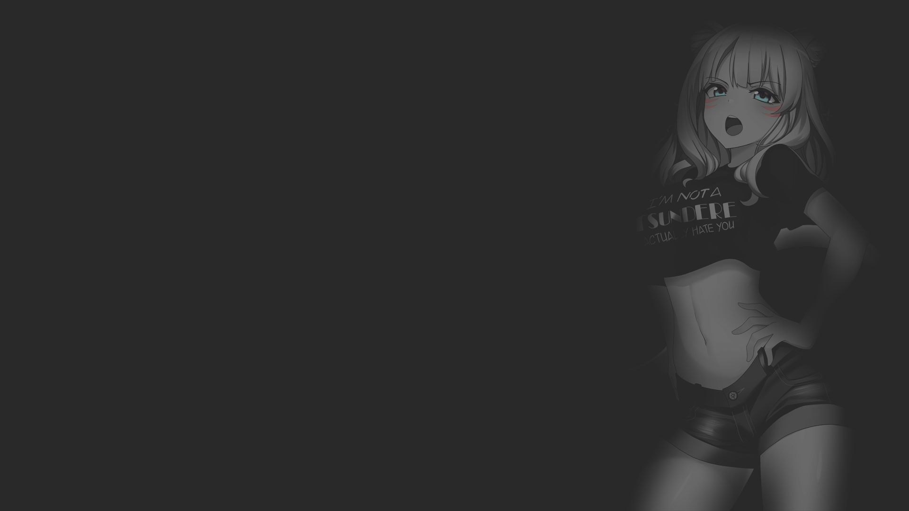

<div align="center">
    <h1>Dotfiles</h1>
    <p>
        These are my personal dotfiles for my GNU/Linux
        development environments.
    </p>
    
</div>

> Much of my setup uses the onedark color scheme.

## Content

> **NOTES:**
> 
> 1. The bspwm setup has some extra dependencies, see its configuration file.
>
> 2. You can also change kwallet in bspwm for another keyring service if you don't
> use KDE as your DE.
> 
> 3. I'm using pipewire instead of pulseaudio but the pavolume script of my polybar _should_ work as expected with pulseaudio too.

- Environment setup
  - Wallpapers
  - Configurations (dynamic colors using pywal)
    - bspwm + [bsp-layout](https://github.com/phenax/bsp-layout)
    - dunst
    - polybar
    - rofi
    - sxhkd
    - picom
- Other configurations
  - Shells
    - ZSH (zinit)
  -  Editors
    - Neovim (Doom Nvim, requires Neovim nightly)
  - Terminal tools
    - bat
    - lsd
    - htop
    - bpytop (with custom onedark theme)
    - neofetch

### Installing

Clone the repository and copy the directories to their proper location,
nothing more.

### Bspwm

I'm using [j-james fork of bspwm](https://github.com/j-james/bspwm-rounded-corners)
with rounded corners support.

Here are the building steps to keep it up-to-date.

```sh
git clone https://github.com/baskerville/bspwm.git

cd bspwm

git remote add round_corners https://github.com/j-james/bspwm-rounded-corners.git

git switch master

git fetch round_corners

git checkout round_corners/master

git rebase origin/master

sudo make install
```

### Neovim

I use [Doom Nvim](https://github.com/NTBBloodbath/doom-nvim) as my daily use
setup for Neovim (Neovim nightly required).

---

### Wallpapers

|                    Clang Anime Girl                    |                Cat girl                |               Nordic               |
| :----------------------------------------------------: |:--------------------------------------:| :--------------------------------: |
|  |  |  |

> All the credits of the images go to their authors (I don't know what they are).
>
> You can find more wallpapers at [wallpapers directory](./wallpapers)
